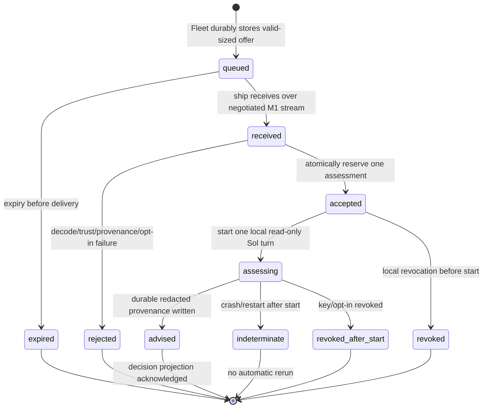
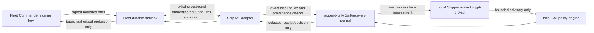

# Fleet Commander M1: delegated read-only recovery protocol

Status: **frozen contract for implementation after security review**  
Version: `fleet-commander-m1/v1`  
Scope: one Commander-signed delegation, at most one ship-local tool-less Sol
recovery assessment, and one redacted response over an already outbound,
authenticated Fleet tunnel.

## 1. Authority and cut line

M1 is a transport and provenance contract, not a remote-execution feature.
The existing local Sail recovery policy, approved voyage/change envelopes,
evidence certificates, Bead ownership, and Captain approval rules remain the
only authorities for local work. A Fleet Commander offer can request a bounded
**read-only assessment**; it cannot approve a voyage, change a task, start a
crew turn, retry work, create a derivative, certify evidence, interrupt a
turn, issue a credential, or mark anything complete.

The ship accepts an offer only when its local configuration has opted in and
the offer exactly binds an already-active local recovery case and approved
voyage/task provenance. Sol's existing `recovery.ResponseV1` remains advisory;
Sail independently validates it under local policy. M1 does not add a new
Fleet identity capability. Tunnel possession, browser identity, a display
label, a model name, or an earlier acceptance never grants this authority.

M1 deliberately excludes web planning, Commander answers, delegation updates
or revocation messages, remote interrupt, generic RPC, shell/terminal access,
remote task dispatch, raw prompt transport, attachments, artifact transfer,
filesystem browsing, and Playwright history. Future milestones may use only
the opaque `reference` values described below; they require new message types,
policy, retention, and approval.

## 2. Normative encoding, identifiers, and cryptography

The words **MUST**, **MUST NOT**, and **SHOULD** are normative. JSON messages
are UTF-8 and RFC 8785 JCS canonical JSON. Before JCS, decoders MUST reject
duplicate object keys, trailing values, invalid UTF-8, non-finite numbers,
unknown fields, and payloads exceeding the relevant bound. Schemas in
[`fleet-commander-m1/`](fleet-commander-m1/) are closed and normative.

All `*_id` values match `^[A-Za-z0-9][A-Za-z0-9_-]{15,95}$`; IDs are opaque,
random, non-secret, and never paths. SHA-256 digests are lowercase 64-character
hex. Times are RFC 3339 UTC strings with exactly three fractional digits, for
example `2026-07-14T19:12:42.123Z`. Clocks are used only for expiry/deadline
checks; ordering comes from durable sequence state.

The Commander key is an Ed25519 public key selected by a local, versioned trust
policy. The Fleet service is a broker and is not a signing oracle. For a
delegation envelope `E`, remove `signature`, JCS-canonicalize the remainder as
`U`, and calculate. In the formulas below, `\\0` denotes the two literal ASCII
bytes backslash (`0x5c`) and zero (`0x30`), matching the canonical vectors; it
is not a NUL byte and implementations MUST preserve that distinction:

```text
envelope_digest = SHA-256("shipmates/fleet-commander/m1/envelope-digest\\0" || U)
signature_input = "shipmates/fleet-commander/m1/envelope-signature\\0" || U
signature       = Ed25519.Sign(commander_private_key, signature_input)
```

`signature` is base64url without padding. The signature, issuer key ID, local
trust-policy version, and envelope digest are all recorded locally. Fleet
transport authentication does not replace this signature check. Message digests
use `shipmates/fleet-commander/m1/message-digest\\0`. For a decision provenance
record `P`, JCS-canonicalize the complete record (the record has no self-digest
field) as `V`, then calculate
`provenance_digest = SHA-256("shipmates/fleet-commander/m1/decision-digest\\0" || V)`.
The enclosing transport wrapper is not independently signed because the
authenticated tunnel binds it to a ship connection generation.

## 3. Local opt-in and delegation envelope

`fleet_commander_m1` is disabled by default. A ship MUST have a restrictive,
locally stored policy naming: the Fleet ID, this exact protocol version,
permitted Commander issuer key IDs, a maximum offer lifetime, and the one
allowed mode `read_only_recovery_assessment`. The policy is a local authority
input; it is not accepted from the Commander or Fleet. Its absence, unreadable
or unsafe storage, revoked issuer, expiry, or plan/task/recovery mismatch is a
closed rejection.

`delegation-envelope.schema.json` defines `fleet.delegation-envelope.v1`.
Important bindings are:

| Field | M1 rule |
| --- | --- |
| `fleet_id`, `ship_id` | Exact local identity; no wildcard or project path. |
| `voyage_plan_hash`, `task_contract_hash`, `state_hash`, `task_id`, `blocker_fingerprint` | Exact immutable current recovery provenance. `task_id` is an opaque local lookup value only: it MUST equal the already-recorded local recovery task ID, is never displayed or passed to Sol, and confers no authority independently of all four hashes. |
| `mode` | Exactly `read_only_recovery_assessment`. |
| `assessment_budget` | Exactly `1`; it is atomically consumed by local Sail. |
| `response_schema` | Exactly `recovery.response.v1`; no Commander-selected model, persona, prompt, tool, or action. |
| `references` | 0–16 opaque, typed, redacted digest references only. They are not URLs, paths, artifacts, or evidence certificates. |
| `issued_at`, `expires_at` | `issued_at < expires_at`; duration at most 10 minutes and within local policy. |

The signed envelope has no free-form instruction, prompt, command, command
arguments, URL, credential, file path, authority grant, or future-extension
field. IDs are compared only to local opaque IDs; digest values and references
are non-dereferenceable values, never interpreted as text. In particular,
`references` MUST NOT be opened, resolved, fetched, rendered, copied into a
Sol request, or used to select a tool, file, artifact, or policy. An
implementation MUST validate the signed object before inspecting references or
invoking Sol. Receipt of a valid envelope is not local acceptance.

## 4. The three bidirectional message types

All messages use the closed `tunnel-message.schema.json` wrapper. A wrapper has
one `message_id`, `delegation_id`, direction-specific `sequence`, cumulative
`ack`, exact `fleet_id`/`ship_id`, `connection_generation`, expiry, and exactly
one typed body.

1. **`delegation.offer.v1`** (`Fleet -> ship`) carries one complete signed
   delegation envelope. Fleet MUST only route it to its envelope audience.
2. **`delegation.receipt.v1`** (`ship -> Fleet`) is the durable application
   receipt. Its result is one of `accepted`, `duplicate`, `rejected`,
   `expired`, or `revoked`; only fixed, non-inventory reason codes
   are permitted. `accepted` means the local journal consumed the one-shot
   assessment budget; it does not mean Sol ran or Sail accepted an action.
3. **`delegation.decision.v1`** (`ship -> Fleet`) is the final redacted
   projection. It contains one of `advised`, `rejected`, `expired`, `revoked`,
   or `indeterminate`, the advisory decision enum if `advised`, and a decision
   provenance digest. It never contains an action hint, raw evidence, private
   Codex/session/thread/turn IDs, prompts, model output, paths, or credentials.

For each body, `result` and `reason_code` MUST form one of the schema's listed
combinations; implementations MUST NOT add a diagnostic string, error detail,
retry hint, or inventory distinction. The Fleet may project those
receipt/decision fields only to an authorized future Commander surface. M1
creates no browser endpoint and no new observer inventory. A response is not
an acknowledgement of remote authority and does not claim that any local action
occurred.

## 5. Sequencing, acknowledgement, reconnect, and backpressure

M1 is an additive substream negotiated after the M7 authentication/accepted
handshake. A ship advertises `fleet.commander.m1` only when local opt-in is
enabled. Fleet advertises it only if it supports the durable mailbox. If either
side omits it, all M1 frames are refused and the M7 observation stream remains
unchanged. M1 frames MUST NOT be encoded as M7 `Frame` values or admitted by
the existing observation frame parser.

Each direction has its own durable sequence space starting at 1 for every
`(ship_id, connection_generation, direction, stream)` tuple. `ack` is the
highest contiguous **transport** sequence durably stored by the receiver; it
is not an application receipt. A sender may retransmit the byte-identical
message with the same sequence and message ID until acknowledged. Different
bytes or type for an existing `(generation, direction, sequence)` is a protocol
violation. Maximum unacknowledged frames per direction is 16; the Fleet mailbox
holds at most 16 unexpired offers per ship and the ship outbox at most 32
receipts/decisions. Each wrapper is at most 16 KiB, an envelope 12 KiB, and a
decision provenance record 8 KiB. Capacity exhaustion rejects the newer offer
with `backpressure`; it never evicts a live message or drops a final decision.

Application idempotency is independent of transport: the ship persists
`delegation_id -> envelope_digest -> lifecycle` before sending `accepted`.
The same delegation ID and digest returns `duplicate` and the retained result;
the same ID with a different digest is `rejected/id_conflict`. A reconnect gets
a new M7 connection generation and new transport sequence spaces, but does not
create another assessment. The prior outbox is replayed on the new generation
until acknowledged. A process restart with `assessment_started` but no durable
final decision returns `indeterminate/restart_after_assessment`; it MUST NOT
run Sol a second time.

M1 has **no semantic supersession or cancellation message**. Connection
supersession follows M7: a new authenticated generation closes the old tunnel.
It does not replace a delegation. A later envelope cannot supersede, cancel, or
amend an earlier envelope; a new work item requires a later approved protocol.

When offline, Fleet may retain an unexpired offer within the mailbox bound but
cannot report delivery or acceptance. It reports `offline` only as a current
transport condition. On expiry it records `expired` and never delivers the
offer. The ship MUST check envelope expiry at receipt and again in the same
durable transition that changes `accepted` to `assessment_started`; if it has
expired, it records and projects `expired` and never starts Sol. An offer
accepted before expiry therefore cannot be queued for later assessment. Ship
credential or ship revocation uses the existing M7 close/sweep;
queued offers are purged. Local Commander-key or opt-in revocation rejects
unaccepted offers. If revocation happens after `accepted` but before Sol starts,
the ship records `revoked`; after Sol starts, it records a redacted
`revoked_after_start` decision and MUST NOT use the result to authorize work.

## 6. Local validation and decision provenance

Ship validation order is fixed: bounded decode; current local opt-in; exact
Fleet/ship audience; expiry; durable delegation-ID conflict check; Commander
key/trust-policy lookup and Ed25519 verification; exact immutable local
recovery provenance; then atomic one-shot budget reservation. The offer wrapper
expiry MUST equal the signed envelope expiry. A ship-generated receipt or
decision wrapper expiry MUST be no later than the local retention deadline and
has no authority meaning. Any failure produces a fixed receipt code and no Sol
process. The only acceptable local
assessment is the existing fresh, empty-`CODEX_HOME`, no-credentials,
tool-less Skipper artifact snapshot with allowlisted `gpt-5.6-sol` override.

`decision-provenance.schema.json` defines the local append-only provenance
record. It records envelope/decision digests; provenance hashes; local policy,
Skipper artifact digest/version, effective model, and recovery schema versions;
sanitized reference digests; lifecycle timestamps; advisory result enum; and
the separately determined Sail validation state. It MUST NOT record raw Sol
text, response action hints, raw evidence, local paths, credentials, private
identifiers, or a claim that Sail executed anything. The only Sail states M1
may project are `not_evaluated`, `advisory_rejected`, and
`locally_accepted_under_existing_policy`; the last is still not execution
confirmation.

## 7. Normative state machine and data flow





## 8. Harmless M1 vertical slice

With a fake tunnel and deterministic fake Sol, enable local M1 policy for one
ship and create an already-active recovery request. Fleet routes one valid,
signed offer bound to that exact request. The ship returns `accepted`, performs
one fresh tool-less local assessment, writes provenance, and returns one
redacted `advised` decision. Assert that a duplicate causes no second Sol turn;
a changed digest is rejected; expired, revoked, wrong ship/fleet, malformed,
or unmatched provenance causes no turn; reconnect replays only durable receipt
or decision; and no task, plan, Bead, evidence certificate, credential, file,
or live Codex turn changes. This is M1's only end-to-end behavior.

## 9. Implementation migration boundary

M1 is additive. It affects `internal/fleettunnel` (post-handshake capability
negotiation and a separate multiplexed substream), `internal/fleetidentity`
(Commander trust-policy lookup/revocation interface, not a new ship/operator
capability), `internal/recovery` (read-only provenance adapter), and
`internal/commands/sail_recovery.go` (local assessment interface only).
`fleetobserve` remains the read-only projection owner; `fleetsteer`,
`fleetinterrupt`, `livesession`, M8/M9 target discovery, and all current M7
`Frame`/`Ack` interfaces are stable and MUST NOT be widened for M1.

The future web planner, Commander answer/approval, interrupt, and Playwright
artifact history must each introduce a new capability, message family, policy,
and retention contract. M1's `references` are opaque typed digest references;
they are not a transport for later data.

## 10. Required conformance vectors

The canonical examples and refusal cases are in
[`fleet-commander-m1/vectors.json`](fleet-commander-m1/vectors.json). An
implementation MUST pass every positive vector and fail every negative vector
before enabling the M1 capability.

### 10.1 Normative verification matrix

The implementation voyage MUST execute every row below in normal and race
mode. A row is PASS only when the stated observable result and the stated
non-effect are both asserted; a parser-only result is insufficient.

| Gate | Required fixture/assertion | Managed worker | Unrestricted host |
|---|---|---:|---:|
| Closed schemas | Envelope, tunnel wrapper/body, and decision provenance reject unknown fields, duplicate keys, unknown types, wrong versions, wrong types, trailing data, and oversize input; canonical positive fixtures round-trip byte-deterministically. | Required | Required |
| Signed binding | Real Ed25519 positive vector verifies its JCS/domain-separated transcript; altered signature, audience, Fleet/ship, plan/task/state, blocker, or issuer fails before Sol. | Required | Required |
| Replay/atomicity | Duplicate and conflicting delegation IDs, concurrent one-assessment reservation, reconnect generation changes, restart-after-start indeterminate state, and byte-identical final replay; Sol runs at most once. | Required | Required |
| Lifecycle authority | Expiry before admission and after acceptance, issuer revocation before start and after start, offline/reconnect, backpressure, and no M1 supersession/cancel operation. | Required | Required |
| Version/isolation | M7-only or wrong-version downgrade refuses M1 while M7 remains unchanged; two configured ships cannot cross-accept or share assessment state. | Required | Required |
| Privacy/redaction | Hostile references are opaque and never dereferenced, rendered, fetched, or sent to Sol; decisions contain only fixed enums, bounded digests, and provenance. | Required | Required |
| Sol boundary | One fresh local read-only, tool-less, credential-free assessment; no generic message, prompt, command, web, planning, interrupt, artifact, Bead, or inbound listener surface. | Socket-free fake only | Required on fake tunnel; no inbound listener |
| Local authority | Advisory response is Sail-validated and redacted; M1 never mutates plan/state/lineage/Beads or authorizes execution. | Required | Required |
| Full release gates | Focused package tests, race tests, schema/vector checks, two-ship/restart/revocation tests, `go test ./...`, race full suite, vet, format, diff, links, and secret/privacy scans. | Socket-free subset | Complete suite |

Required future commands are:

```text
go test ./internal/fleetcommander ./internal/fleettunnel ./internal/fleetidentity ./internal/recovery -run 'Test(M1|Commander|Delegation|Vector|Schema|Replay|Revocation|TwoShip)' -count=1
go test -race ./internal/fleetcommander ./internal/fleettunnel ./internal/fleetidentity ./internal/recovery -run 'Test(M1|Commander|Delegation|Vector|Schema|Replay|Revocation|TwoShip)' -count=1
go test ./... 
go test -race ./...
go vet ./...
gofmt -l .
git diff --check
for f in docs/contracts/fleet-commander-m1/*.json; do jq -e . "$f" >/dev/null; done
jsonschema -i docs/contracts/fleet-commander-m1/valid-offer.json docs/contracts/fleet-commander-m1/delegation-envelope.schema.json
jsonschema --base-uri file:///absolute/path/to/docs/contracts/fleet-commander-m1/ -i docs/contracts/fleet-commander-m1/valid-offer-message.json docs/contracts/fleet-commander-m1/tunnel-message.schema.json
jsonschema -i docs/contracts/fleet-commander-m1/valid-decision-provenance.json docs/contracts/fleet-commander-m1/decision-provenance.schema.json
./scripts/verify-codex-runtime-closure.sh  # only on an unrestricted host when its listener checks are enabled
rg -n -i '(-----BEGIN [A-Z ]+ PRIVATE KEY-----|AKIA[0-9A-Z]{16}|gh[pousr]_[A-Za-z0-9]{20,}|sk-[A-Za-z0-9]{20,})' docs/contracts/fleet-commander-m1 .shipmates/reports/fleet-commander-m1
```

Managed workers MUST report listener-dependent failures separately and MUST
not convert them to PASS by retrying or weakening assertions. The M1 fake
tunnel remains socket-free; an unrestricted host is required only for any
future real-listener composition gate.

## 11. Backend implementation-feasibility map (non-normative)

The following map is an implementation plan only; it does not widen the
normative M1 contract or authorize runtime behavior. Existing observation,
exact-turn control, voyage, Beads, and recovery data remain separate.

| Current seam | Future additive owner/types/files | Dependencies and transaction boundary | Estimate |
| --- | --- | --- | --- |
| `internal/fleetidentity` registry and authority store | Commander trust-policy lookup and revocation interface; future `commander_policy.go` and `commander_store.go` adjacent to, but not merged into, ship/operator credentials | Verify issuer, Fleet/ship audience, expiry, and policy version before mailbox admission. Keep Commander keys in a separate versioned store partition. Reuse the registry mutex and atomic authority replacement only for identity lifecycle; never expose signing material through tunnel or project state. | M (2–3 days) |
| `internal/fleettunnel` post-M7 handshake | Future `CommanderCapability`, `CommanderStream`, and closed M1 message codec, likely in `commander_stream.go`; leave `Frame` and `Ack` unchanged | Advertise exact `fleet.commander.m1` only when both endpoint and local opt-in support it. Multiplex a distinct stream/correlation lane over the already ship-initiated authenticated channel; reject M1 bytes on the M7 frame parser. Per-stream sequence/ack state is durable and bounded independently of observation. | M (2–3 days) |
| `internal/fleetobserver` production composition | Future Commander adapter composed beside `Service`, not inside observer HTTP handlers | Observer remains the sole M7 projection owner. M1 receipts/decisions must not enter the observer projection, event replay, UI, or observer credential surface. The production composition may pass the typed stream endpoint to the M1 adapter without adding an inbound listener. | S–M (1–2 days) |
| `internal/recovery` contracts and journal | Future `M1Assessment`/`M1Provenance` adapter over the stable bounded `RequestV1`/`ResponseV1` and Skipper-first assessment interface | Validate the signed envelope and local provenance before calling the adapter. Store M1 lifecycle and redacted decision records in a new M1 journal; do not add M1 records to the existing Sail recovery JSONL journal or reinterpret its sequence/budget. | M (2–3 days) |
| `internal/commands/sail_recovery.go` | Future narrow `ReadOnlyAssessment` interface/implementation boundary; no M1 transport code in command parsing | Sail remains the local authority. It supplies only immutable bounded request facts, validates the parsed advisory, and projects the fixed M1 state. The existing pinned Skipper snapshot and fixed `gpt-5.6-sol` model override are reused behind this interface; no dependency on `sailRecovery`, dispatcher globals, or Codex session internals is part of the M1 contract. | M (2 days) |
| `internal/project/project.go` and local policy | Future `fleet_commander_m1` opt-in configuration and strict policy loader, disabled by default | Read a local policy naming exact Fleet, protocol, trusted issuer IDs, lifetime, and mode. Store it outside committed `shipmates.yaml` where it contains sensitive trust material. Absence, unsafe mode, malformed policy, or disabled config causes a fixed rejection before any inventory lookup. | S–M (1–2 days) |
| `internal/voyage` plan/state/lineage | No new owner in M1; future adapter reads exact plan/task/state hashes | M1 compares the offer to the existing approved plan and recovery state only. It MUST NOT write plan hashes, state, lineage, successor plans, or task status. Any future derivative activation uses the existing `recovery.Derive`/voyage lineage contracts in a later milestone, not M1 messages. | S (0.5–1 day) |
| Beads integration | No M1 writer; opaque provenance may be retained only if a later contract explicitly permits it | No create, close, reopen, reassign, dependency mutation, or graph lookup. M1's `task_id` remains a local lookup value and is never displayed or passed to Sol; Bead IDs must not cross the redacted projection. | S (0.5 day) |
| Fleet authority storage | New bounded mailbox/replay partition under the existing authority-store root, e.g. `commander-m1/`; future `mailbox_store.go` | Keep offers, transport sequence state, expiry, and redacted outbound replay separate from `fleet-authority.json` semantics. Use owner-only regular files, no-follow validation, bounded append/replace records, file+directory sync, and an exclusive lock around admission/sequence publication. No existing authority record is migrated or rewritten. | M (2–3 days) |
| Ship local storage | New project-local `.shipmates/fleet-commander-m1/` journal/outbox partition, with future `assessment_store.go` | A single lock covers delegation digest conflict check, expiry recheck, one-shot reservation, and durable lifecycle transition. The assessment record includes the reservation/start/final state needed for restart reconciliation. Append receipt/decision bytes before network acknowledgement; replay returns the retained redacted bytes. | M (3–4 days) |

### One-assessment atomicity and replay

The ship-side key is `(fleet_id, ship_id, delegation_id)`, with the signed
envelope digest and exact connection generation checked on every transition.
The future store should use one bounded record containing the digest, lifecycle,
transport receipt/decision bytes, and assessment provenance, or an equivalent
transaction journal with an unambiguous commit marker. The lock/transaction
sequence is:

1. Decode and validate the closed offer without inspecting or dereferencing
   opaque references.
2. Under the M1 store lock, reject a conflicting delegation ID, recheck
   expiry/revocation and exact local hashes, and reserve the one assessment.
3. Persist `accepted`/`assessment_started` before running Sol. A crash after
   start reopens as `indeterminate/restart_after_assessment`; it never runs Sol
   again.
4. Run one fresh read-only, tool-less, credential-free assessment from the
   captured Skipper artifact snapshot.
5. Parse and Sail-validate the closed response, append the bounded provenance
   and final redacted decision, sync it, then send/replay transport messages.

An identical retransmission is byte-identical replay. The same delegation ID
   with a different digest is an `id_conflict`; a new connection generation
   changes transport sequence space but not application idempotency. Mailbox
   and outbox limits are enforced before publication and never evict a final
   decision.

### Negotiation, multiplexing, and projection boundaries

The current `fleettunnel.Server`/`Client` handshake returns only observation
capabilities and the current loop admits only typed M7 `Frame` values. The
implementation seam is immediately after the authenticated `Accepted` message:
both endpoints exchange the exact M1 capability, then bind a separate M1
stream to the same ship connection generation. The websocket remains
ship-initiated; no ship listener, HTTP endpoint, reverse listener, or generic
RPC is introduced. M1 send/receive loops must not call the observer projection
or share its cursor/sequence state.

The redaction boundary is the ship-side M1 adapter. Only fixed lifecycle and
reason enums, the bounded advisory enum, digest references, and the provenance
digest may leave the ship. Raw Sol text, prompts, evidence contents, paths,
credentials, Bead/task inventory, local session/thread/turn IDs, model output,
and backend diagnostics are rejected or discarded before the decision is
serialized. The Commander/Fleet side sees only the closed decision projection;
it is not a source of local authority.

### Additive migration and rollback

Migration is staged without data conversion:

1. Ship schemas, canonicalization, refusal vectors, and store code are added
   with no capability advertisement.
2. A `fleet_commander_m1` opt-in defaults to false. Disabled or absent policy
   performs no M1 reads or writes and leaves the current observation path
   byte-for-byte unchanged.
3. Enabled peers advertise the exact capability only after policy, store, and
   bounded mailbox initialization succeed. Peers without the capability keep
   the M7 observation connection; they do not receive M1 frames.
4. The harmless fake-tunnel vertical slice is enabled only after replay,
   expiry, revocation, privacy, and race tests pass.

Rollback is a configuration/binary rollback: disable the opt-in, stop
   advertising and accepting M1, and retain the separate M1 files for explicit
   later inspection or removal. Do not rewrite observation frames, M7 cursors,
   fleet authority records, plan hashes, Beads, recovery journals, or active or
   completed voyage state. Any partially written M1 record is rejected on
   restart; the existing observation service continues independently.

The current contract is feasible with these additive seams. It is infeasible
to implement M1 by widening `Frame`/`Ack`, reusing the existing recovery journal
as a second authority, exposing a public observer route, or activating a Sail
action; each would violate the frozen boundary and is explicitly deferred.
