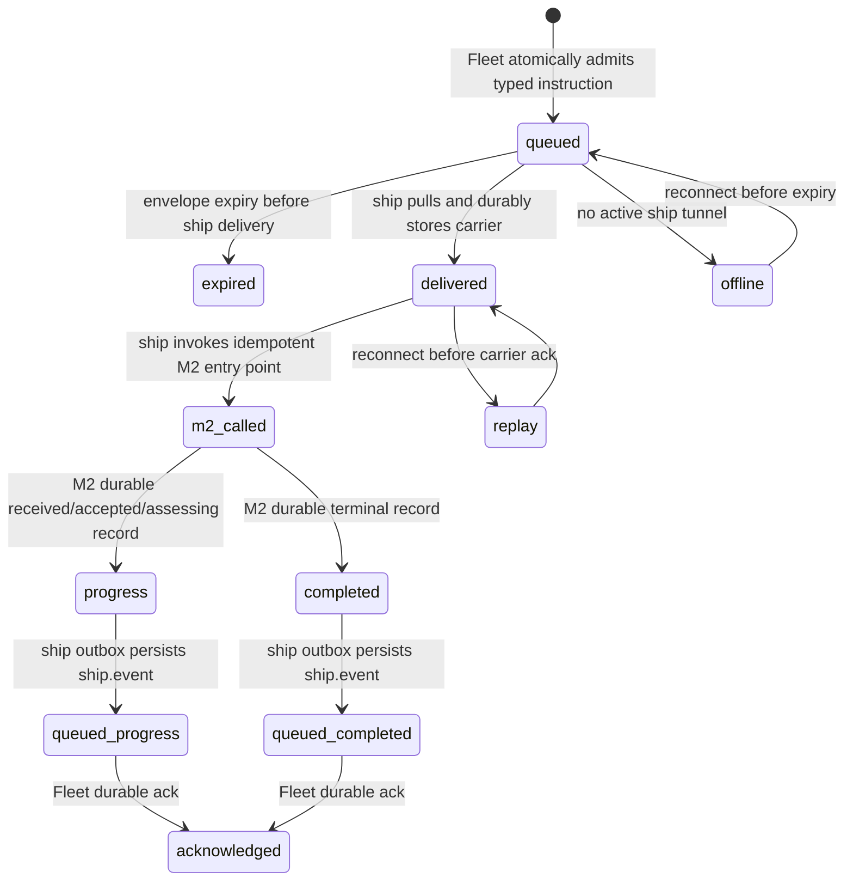
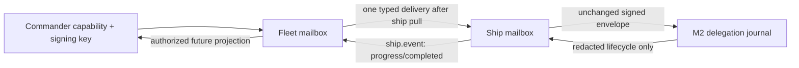

# Fleet Commander M3: durable typed mailbox slice

Status: **frozen additive contract for M3 implementation**  
Version: `fleet-commander-m3/v1`  
Depends on: `fleet-commander-m1/v1` and the M2 local delegation runtime.

## 1. Cut line and authority

M3 adds a durable mailbox over the existing ship-initiated authenticated tunnel.
It transports one immutable M2 envelope to its exact ship and returns only
redacted M2 lifecycle projections. It does not add a prompt, command, generic
RPC, plan/approval action, retry, derivative, evidence certification, task or
Bead mutation, interrupt, steer, file/artifact transport, browser surface, or
inbound ship listener.

`commander.instruction.v1` is a delivery wrapper, not an instruction language:
its sole payload is the unchanged complete signed
`fleet.delegation-envelope.v1`. The ship passes that envelope to M2's existing
idempotent `AcceptAndAssess`; M2 alone validates signature, local opt-in,
provenance, expiry, revocation, reservation, and one-assessment budget.
M3 neither revalidates into a second authority state nor recreates assessment
lifecycle. `captain.progress.v1` and `captain.completed.v1` are redacted,
derived M2 records; neither confirms local work execution.

M3 defines a new capability `fleet.commander.delegate.v1`. It is distinct from
observe, steer, interrupt, ship, enrollment, and any future approve capability.
Fleet admission requires this capability, exact Fleet/Ship allowlist, active
credential generation, and matching registered Commander signing key. Ship M2
validation remains independently necessary. No M3 message authorizes Sail.

## 2. Encoding and common fields

JSON is UTF-8 RFC 8785 JCS; duplicate keys, trailing values, unknown fields,
invalid UTF-8, non-finite values, and oversized input fail closed before use.
All identifiers, digests, and timestamps use the M1 grammar. The M3 message
digest is:

```text
SHA-256("shipmates/fleet-commander/m3/mailbox-message-digest\\0" || JCS(message))
```

`\\0` is literal ASCII backslash-plus-zero, not NUL. The digest identifies
immutable mailbox bytes; only the inner M1 envelope is Commander-signed.
Transport authentication binds a carrier to the current ship connection.

Each mailbox message has opaque `message_id`, `instruction_id`, exact
`fleet_id` and `ship_id`, sender direction, durable `mailbox_sequence`, an
expiry, and one closed body. `instruction_id` is a Fleet mailbox identity;
`delegation_id` inside the envelope remains M2's assessment identity. An
instruction can reference exactly one envelope, and a mailbox accepts exactly
one instruction row for `(fleet_id, ship_id, instruction_id)`.

## 3. Typed messages and projection combinations

Schemas in [`fleet-commander-m3/`](fleet-commander-m3/) are normative.

| Message | Direction | Required meaning |
| --- | --- | --- |
| `commander.instruction.v1` | Fleet → ship | Immutable signed M1 envelope only. Its `envelope_digest` must equal the M1 canonical envelope digest. |
| `captain.progress.v1` | ship → Fleet | Redacted non-terminal M2 lifecycle: `received`, `accepted`, or `assessing`; no recommendation, reason detail, or local data. |
| `captain.completed.v1` | ship → Fleet | Redacted terminal M2 outcome: `advised`, `rejected`, `expired`, `revoked`, or `indeterminate`, with only allowed reason/advisory/Sail-state combination and provenance digest. |

M3 never forwards M1 `delegation.receipt.v1` or `delegation.decision.v1`
verbatim; it derives these projections from M2 durable records. This prevents
two competing delivery journals and avoids exposing M2 internal fields.
`received` is the sole mailbox-owned progress fact (durable ship inbox commit);
`accepted` and `assessing` are projections of M2 records. No other progress
state is permitted. Terminal combinations are exact: `advised/advised`,
`rejected/response_invalid`, `expired/expired`,
`revoked/(revoked|revoked_after_start)`, and
`indeterminate/restart_after_assessment`. `advisory_decision` is required only
for `advised`; all non-advised terminal states have `not_evaluated` Sail state.

### Amendment: ship event carrier

The original M3 carrier list omitted the legal ship-to-Fleet business carrier:
`fleet.delivery.v1` can only carry Fleet-to-ship instruction bytes, while
`mailbox.ack.v1` is deliberately transport-only. This successor correction
resolves that ambiguity without changing M1/M2 authority or creating generic
duplex messaging.

The only carrier types are `ship.pull.v1`, `fleet.delivery.v1`,
`ship.event.v1`, and `mailbox.ack.v1`. Every carrier MUST include both
`fleet_to_ship_ack` and `ship_to_fleet_ack` cumulative durable cursors, even
when it has no business body. Their acknowledgement meaning is transport-only.

| Carrier | Direction | Business body |
| --- | --- | --- |
| `ship.pull.v1` | ship → Fleet | None; bounded poll and cursors only. |
| `fleet.delivery.v1` | Fleet → ship | Exactly one `commander.instruction.v1`. |
| `ship.event.v1` | ship → Fleet | Exactly one `captain.progress.v1` or `captain.completed.v1`. |
| `mailbox.ack.v1` | either | None; cursors only. |

Business-message `mailbox_sequence`, `message_id`, and `instruction_id` remain
inside the closed business message and are independent from carrier cursors.
`ship.event` is durably written to the ship outbox before send and is replayed
byte-identically until Fleet acknowledges its sequence. A carrier ACK never
means M2 accepted, assessed, advised, or executed work.

## 4. Stores, transaction boundaries, and sequencing

Fleet owns a new bounded `fleetcommandermailbox` store partition. It stores the
immutable accepted instruction bytes/digest, sender capability generation,
expiry, per-ship outbound sequence, ship acknowledgement cursor, and redacted
ship event inbox. Ship owns a separate `delegationmailbox` inbox/outbox holding
only carrier delivery/cursor/event-projection state. M2's
`.shipmates/delegations/<plan-hash>.jsonl` remains the sole assessment source
of truth. Neither mailbox may write M2 records except by calling its one public
idempotent entry point.

Fleet admission atomically validates Commander capability/audience/expiry and
persists the immutable instruction with the next Fleet-to-ship
`mailbox_sequence`. Ship delivery atomically persists the envelope bytes/digest
in its inbox before sending carrier acknowledgement. Only after that commit may
the local adapter call M2. Every durable M2 lifecycle change creates one
deterministic projection key `(delegation_id, m2_record_digest, projection_kind)`;
the ship stores it in its outbox before sending. On restart it scans M2 records
and regenerates missing outbox rows without invoking Sol.

Sequences are durable and monotonic independently per `(fleet_id, ship_id,
direction)` mailbox; they do not reuse M7 frame numbers, observation cursors,
or M8/M9 operation IDs. `mailbox.ack` contains the highest contiguous durable
mailbox sequence for its direction. Replayed bytes with the same sequence and
digest are idempotent; a changed byte/type/digest at an existing sequence is a
protocol violation. The ship sends its two acknowledgement cursors in every
pull, allowing reconnect/resume without a second assessment.

## 5. Expiry, revocation, backpressure, and supersession

An instruction expiry must equal its enclosed envelope expiry and may not be
more than ten minutes after issue. Fleet refuses admission after expiry and
marks undelivered rows expired at expiry; ship still passes delivery to M2 only
when current M2 checks permit it. A Fleet commander-capability revocation stops
new admission and purges undelivered rows. Ship credential revocation retains
durable mailbox/M2 state but closes the M7 tunnel and prevents delivery. Local
issuer/opt-in revocation follows M2: before start it prevents Sol; after start
it yields redacted `revoked_after_start` and never authorizes work.

There are at most 16 unacknowledged live Fleet instructions per ship and 32
unacknowledged ship projections. Fleet rejects a new instruction with
`backpressure` before mailbox admission; it never evicts a live instruction.
Ship may coalesce repeated identical `received`/`accepted` progress records,
but never terminal completed records. If its outbox is full, it stops pulling
new delivery and retains terminal facts until capacity is acknowledged.

M3 has no semantic supersession, cancellation, or replacement. A later
instruction cannot cancel or amend a prior one. Existing M7 connection
supersession closes the old connection and starts a new transport generation;
mailbox cursor replay continues across it. A different envelope for the same
M2 delegation is an M2 conflict, not supersession.

## 6. Capability negotiation and offline state machine

After the existing M7 authentication handshake, the ship advertises
`fleet.commander.mailbox.v1` only if M2 local opt-in, M2 store recovery, and
ship mailbox initialization succeed. Fleet advertises it only with a healthy
mailbox partition and configured Commander capability authority. If either
omits it, the M7 observation stream continues unchanged and all M3 carrier
bytes are refused. Carrier frames are outside M7 `Frame`/`Ack` parsing.

The physical connection remains ship-initiated. The ship polls with a bounded
`ship.pull.v1` (maximum one outstanding pull, 15-second deadline); Fleet may
reply with one pending `fleet.delivery.v1` or an empty bounded delivery. This
avoids unsolicited Fleet writes and adds no listener or generic duplex channel.



Offline is a transport state only: it neither accepts nor starts an assessment.
Fleet may retain an unexpired instruction within bounds. A disconnect after
ship inbox commit can result in replay, but M2 idempotency prevents another
assessment. Fleet restart restores durable mailbox records and cursors; if a
durable terminal projection is absent, it reports no completion rather than
inventing one.

## 7. Harmless M3 vertical slice and migration

Using two fake authenticated tunnel endpoints and one configured Commander
principal, submit one valid immutable instruction for a known M2 recovery case.
The ship pulls it, durably acknowledges carrier receipt, invokes M2 once, emits
one `ship.event` carrying a `received`/`accepted` progress projection and one
`ship.event` carrying a redacted terminal completed projection, then replays
unacknowledged event bytes after reconnect. Assert
that no plan/task/Bead/evidence/credential/live-Codex mutation occurs, an
identical replay causes no second Sol turn, a conflicting envelope is refused,
and M7 observation bytes/cursors and M8/M9 paths are unchanged.

Implementation adds `internal/fleetcommander` codecs/capability policy,
`internal/fleetcommandermailbox` Fleet storage, and
`internal/delegationmailbox` ship delivery storage. `internal/fleettunnel`
gets only an additive negotiated pull carrier seam. `internal/delegation` is
not widened beyond its existing idempotent intake and redacted lifecycle lookup.
Disable capability advertisement to roll back; do not migrate or rewrite M2,
recovery, voyage, Bead, observation, steer, or interrupt state.



## 8. Required verification

Implementations must pass closed-schema/vector tests; normal and race tests for
Fleet/ship mailbox, M2 delegation, tunnel negotiation, two-ship isolation,
restart/reconnect/revocation/backpressure; then `go test ./...`,
`go test -race ./...`, `go vet ./...`, `gofmt -l .`, `git diff --check`, JSON
schema validation, documentation link checks, and secret/private-ID scans.
Socket-free mailbox tests are mandatory in managed environments. Any real
listener composition gate is explicitly unrestricted-host evidence and cannot
turn a socket-free failure into a product pass.
