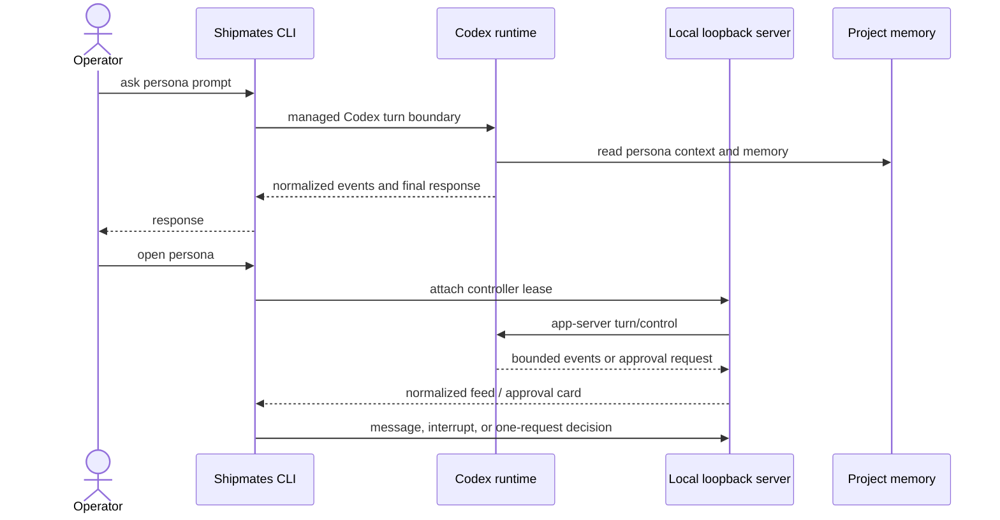
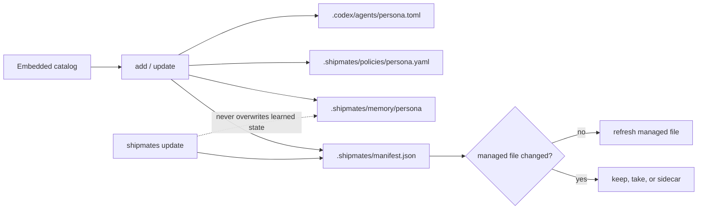
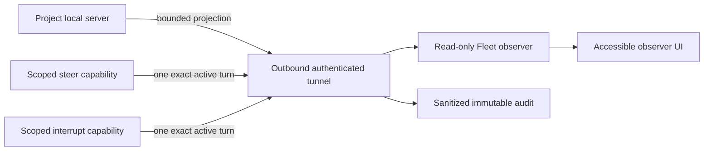

# Runtime diagrams

These diagrams describe only the shipped Codex-native runtime. Source Mermaid
files live in [`docs/diagrams/`](diagrams/).

## Local delegation and control

## Installed state

## Fleet observation and exact-turn operations

## Upgrade and explicit legacy migration

Normal `update` operates only on the current managed manifest. A manifest-v1
project must invoke `migrate codex --plan` and then explicitly choose `--apply`.
Modified and untracked legacy data is preserved and is never executed.
