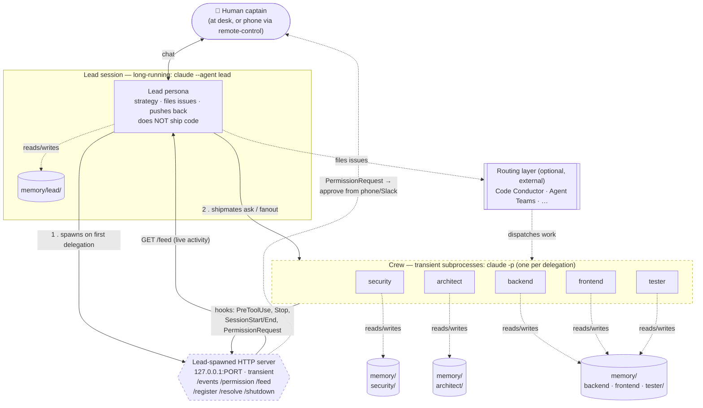
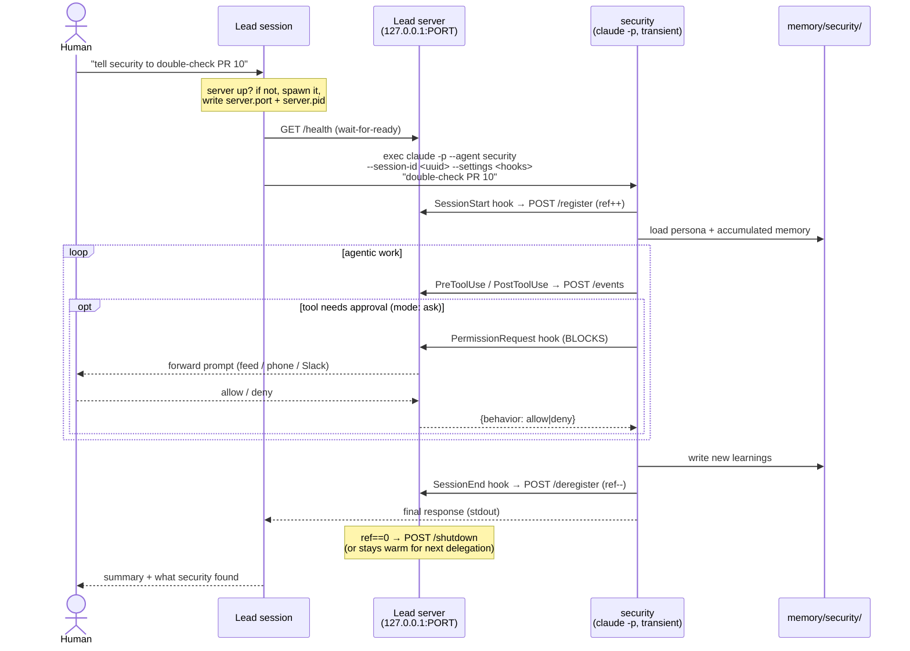
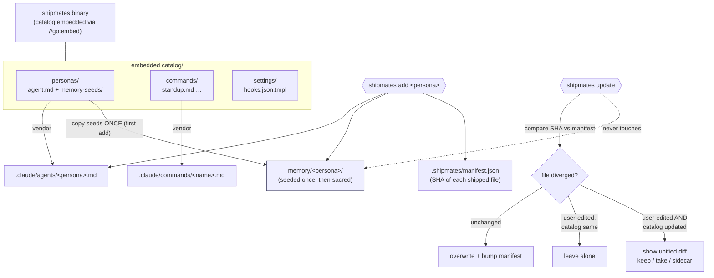

# Shipmates — Architecture Diagrams

Companion to [`architecture.md`](architecture.md). Three views: system topology, the delegation + hook lifecycle, and the install/update flow.

---

## 1. System topology

How the pieces sit at runtime. The **lead session** is the only long-running `claude`; **crew** are transient subprocesses spawned per delegation; the **server** is a transient local HTTP process the lead owns. Memory is plain files on disk, one dir per persona.

> Dashed-border boxes (server, crew) are **transient** — they exist only while work is happening. Solid = persistent (lead session, memory dirs).

---

## 2. Delegation + hook lifecycle

One `shipmates ask security "review PR 10"` from start to finish. The crew member is a one-shot subprocess that resurrects security's saved session for a single turn, streams activity to the server via hooks, and persists the new turn back to disk on exit.

---

## 3. Install & update flow (embedded catalog)

The catalog ships **inside the Go binary** (`//go:embed`). The binary version *is* the catalog version. `shipmates update` refreshes installed files but never touches accumulated memory, and prompts with a diff on conflict.

---

*Source: these are [Mermaid](https://mermaid.js.org) diagrams — they render on GitHub automatically and can be edited inline.*
