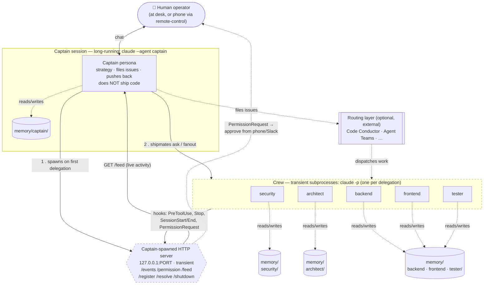
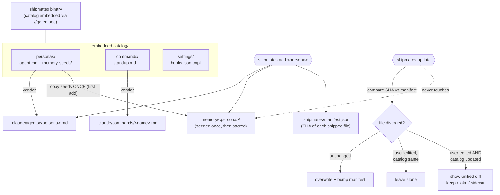
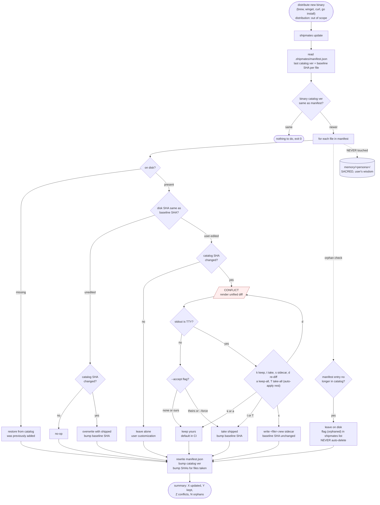

# Shipmates — Architecture Diagrams

Companion to [`architecture.md`](architecture.md). Four views: system topology, the delegation + hook lifecycle, the install/update overview, and the upgrade path in detail.

---

## 1. System topology

How the pieces sit at runtime. The **captain session** is the only long-running `claude`; **crew** are transient subprocesses spawned per delegation; the **server** is a transient local HTTP process the captain owns. Memory is plain files on disk, one dir per persona.

> Dashed-border boxes (server, crew) are **transient** — they exist only while work is happening. Solid = persistent (captain session, memory dirs).

---

## 2. Delegation + hook lifecycle

One `shipmates ask security "review PR 10"` from start to finish. The crew member is a one-shot subprocess that resurrects security's saved session for a single turn, streams activity to the server via hooks, and persists the new turn back to disk on exit.

---

## 3. Install & update flow (embedded catalog)

The catalog ships **inside the Go binary** (`//go:embed`). The binary version *is* the catalog version. `shipmates update` refreshes installed files but never touches accumulated memory, and prompts with a diff on conflict.

---

## 4. Upgrade path (end-to-end)

What [diagram #3](#3-install--update-flow-embedded-catalog) glosses over. Starts at "user dropped in a new `shipmates` binary" and ends at "manifest rewritten, summary printed." Covers the full per-file decision tree, the conflict-prompt UX (TTY *and* non-TTY), orphan flagging, and the memory dir's untouchable status — the contract being: `shipmates update` is safe to run anytime, and the worst it can do to your work is ask you a question.

Distribution of the new binary itself (`brew upgrade`, `winget upgrade`, `go install ...@latest`, raw `curl`) is out of scope — the diagram starts the moment a newer binary is on `$PATH`.

> **Three invariants worth naming.** (1) The memory dir is never read or written by `update` — accumulated learnings survive every upgrade unconditionally. (2) Orphaned files (in your manifest, removed from a newer catalog) are flagged but never deleted — removal is always a human decision. (3) Per-file *baseline SHAs* are only bumped for files actually overwritten or taken; "keep yours" leaves the baseline alone so a later catalog update can still detect the original divergence. The manifest's overall *catalog version* bumps once per successful run regardless, so you can always tell which shipped version your project was last reconciled against.

---

*Source: these are [Mermaid](https://mermaid.js.org) diagrams — they render on GitHub automatically and can be edited inline.*
